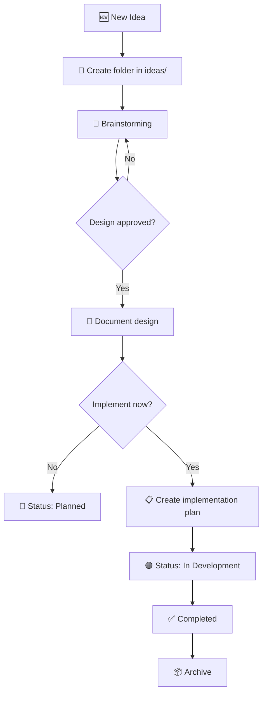

<p align="center">
  
  
  
  
</p>

# 🧠 Ideas Hub

**An open-source idea management system for developers** — capture, brainstorm, design, and plan your project ideas using structured templates and AI-powered workflows.

Ideas Hub is a Git-based repository template that gives you a proven framework to go from a raw idea to a detailed implementation plan. It integrates with AI coding agents (like Gemini, Claude, Cursor, etc.) to automate brainstorming, documentation, and planning through built-in skills and workflows.

---

## ✨ Why Ideas Hub?

Most developers keep ideas scattered across notes apps, random files, or just in their heads. Ideas get lost, forgotten, or never developed beyond a vague concept.

**Ideas Hub solves this** by providing:

| Feature | Description |
|---------|-------------|
| 📁 **Structured organization** | Every idea gets its own folder with standardized documentation |
| 🧠 **AI-powered brainstorming** | Built-in `brainstorming` skill explores your idea, asks the right questions, and proposes approaches |
| 💰 **Monetization analysis** | Automatic monetization strategy evaluation for commercial ideas |
| 📝 **3 professional templates** | Idea capture, design document, and implementation plan |
| 📊 **Status tracking** | Visual emoji-based status system from draft to completion |
| 📦 **Archiving system** | Clean workflow for completed or paused ideas |
| 🤖 **Agent instructions** | Pre-configured `agents.md` so AI assistants know exactly how to help |

---

## 🚀 Quick Start

### 1. Use this template

Click **"Use this template"** on GitHub, or clone it directly:

```bash
git clone https://github.com/YOUR_USERNAME/ideas-hub.git
cd ideas-hub
```

### 2. Register your first idea

Tell your AI agent:

> "Register a new idea: [describe your idea here]"

The agent will automatically:

1. Create a folder in `ideas/your-idea-name/`
2. Run the **brainstorming** skill to explore the idea with you
3. Evaluate **monetization strategies** (if applicable)
4. Generate a complete **design document**
5. Create a detailed **implementation plan** (when you're ready to build)

### 3. No AI agent? No problem

You can also use Ideas Hub manually:

```bash
# Create your idea folder
mkdir -p ideas/my-awesome-idea/docs/plans

# Copy the idea template
cp templates/idea-template.md ideas/my-awesome-idea/README.md

# Edit and fill in your idea
```

---

## 📁 Repository Structure

```
ideas-hub/
├── ideas/                  → All project ideas
│   └── idea-name/          → Each idea in its own folder
│       ├── README.md       → Complete idea description
│       └── docs/
│           └── plans/      → Design docs and implementation plans
│
├── templates/              → Reusable templates
│   ├── idea-template.md    → New idea capture template
│   ├── design-template.md  → Design document after brainstorming
│   └── plan-template.md    → Step-by-step implementation plan
│
├── archive/                → Completed or paused ideas
├── agents.md               → AI agent instructions
├── CONTRIBUTING.md         → How to contribute
├── LICENSE                 → MIT License
└── README.md               → You are here
```

---

## 📝 Templates

Ideas Hub includes 3 professional templates that guide you through the complete lifecycle of an idea:

### 1. Idea Template (`idea-template.md`)

Captures the essential aspects of a new idea:

- **Problem & Solution** — What problem does it solve and how?
- **Target Audience** — Who benefits from this?
- **Tech Stack** — Proposed technologies with justifications
- **MVP Definition** — Minimum viable features for v1
- **Monetization** — Revenue model (if applicable)
- **Risks & Mitigation** — What could go wrong and how to address it

### 2. Design Template (`design-template.md`)

Produced after the brainstorming phase:

- **Evaluated Approaches** — 2-3 options with trade-offs
- **Selected Approach** — The winner and why
- **Architecture** — System design with Mermaid diagrams
- **Data Model** — Database schema and relationships
- **Testing Strategy** — Unit, integration, and E2E plans

### 3. Plan Template (`plan-template.md`)

A granular, actionable implementation plan:

- **TDD workflow** — Test → Verify Fail → Implement → Verify Pass → Commit
- **Exact file paths** and commands
- **2-5 minute tasks** for steady progress
- **Verification checklist** before marking complete

---

## 📊 Idea Status Tracking

Every idea has a visual status indicator:

| Emoji | Status | Description |
|-------|--------|-------------|
| 🟡 | **Draft** | Newly captured idea, not yet refined |
| 🟢 | **In Design** | Brainstorming and design in progress |
| 🔵 | **Planned** | Design approved, implementation plan created |
| 🟣 | **In Development** | Implementation in progress |
| ✅ | **Completed** | Project finished and deployed |
| ⚫ | **Archived** | Paused indefinitely or discarded |

---

## 🤖 AI Agent Integration

Ideas Hub is designed to work seamlessly with AI coding agents. The `agents.md` file contains complete instructions for:

- **Brainstorming workflow** — Structured exploration using the `brainstorming` skill
- **Documentation standards** — Markdown best practices via the `markdown-documentation` skill
- **Implementation planning** — Granular task breakdown using the `writing-plans` skill
- **Monetization analysis** — Revenue strategy evaluation using the `monetization-strategy` skill

### Compatible AI Agents

| Agent | How to Use |
|-------|-----------|
| **Gemini (Google)** | Add `.agents/` folder with skills |
| **Claude (Anthropic)** | Reference `agents.md` as project instructions |
| **Cursor** | Include `agents.md` in project context |
| **GitHub Copilot** | Reference templates in chat |

---

## 🔄 Complete Workflow



---

## ❓ Frequently Asked Questions

### What is Ideas Hub?

Ideas Hub is an open-source, Git-based idea management system for developers. It provides structured templates and AI-powered workflows to help you capture, develop, and plan your project ideas — from initial concept to detailed implementation plan.

### Who is Ideas Hub for?

Ideas Hub is for developers, indie hackers, and technical creators who have lots of project ideas and want a systematic way to capture, evaluate, and develop them. It works for solo developers and small teams alike.

### Do I need an AI agent to use Ideas Hub?

No. While Ideas Hub is optimized for AI agent workflows (brainstorming, documentation, planning), you can use it entirely manually by copying and filling in the templates yourself.

### How is this different from Notion or Trello?

Ideas Hub lives in your Git repository — no external tools, no accounts, no subscriptions. Your ideas are versioned, portable, and private. The AI agent integration automates the tedious parts of idea documentation that you'd have to do manually in Notion or Trello.

### Can I use this for team idea management?

Yes. Since it's Git-based, multiple team members can contribute ideas via branches and pull requests. The `CONTRIBUTING.md` file explains the workflow.

### What AI skills are included?

Ideas Hub ships with configurations for 4 AI skills: `brainstorming` (idea exploration), `markdown-documentation` (formatting), `writing-plans` (implementation planning), and `monetization-strategy` (revenue analysis).

---

## 🤝 Contributing

Contributions are welcome! Whether it's improving templates, adding new features, or fixing documentation — every contribution helps.

See [CONTRIBUTING.md](CONTRIBUTING.md) for details on how to get started.

---

## 📄 License

This project is licensed under the [MIT License](LICENSE) — use it, modify it, share it freely.

---

<p align="center">
  <strong>⭐ If Ideas Hub helps you organize your ideas, consider giving it a star!</strong>
</p>
