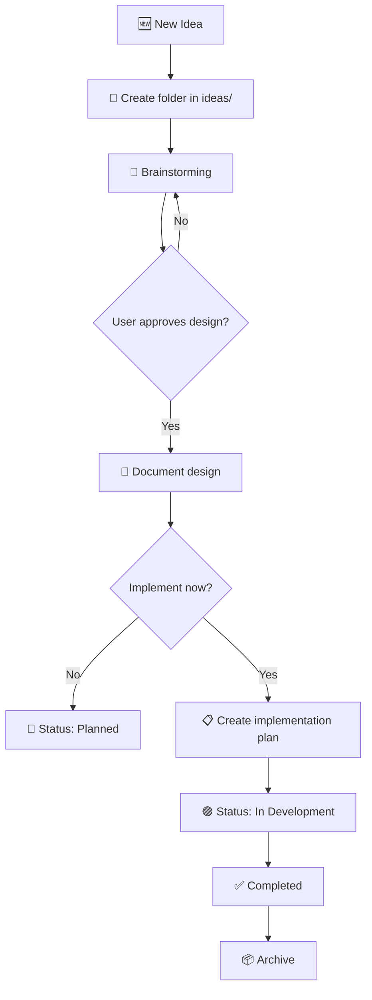

# Agent Instructions — Ideas Hub

## Purpose

This file defines instructions for AI agents working with this Ideas Hub repository. Every action related to ideas must follow the structured workflow described below. These instructions are compatible with any AI coding agent (Gemini, Claude, Cursor, Copilot, etc.).

---

## 🆕 Workflow for Registering a New Idea

> [!IMPORTANT]
> **ALWAYS** use the `brainstorming`, `markdown-documentation`, and `writing-plans` skills in that order when registering a new idea.

### Step 1: Create the idea folder

1. Create a folder in `ideas/<kebab-case-name>/`
2. Copy the content from `templates/idea-template.md` to `ideas/<name>/README.md`
3. Create the sub-folder `ideas/<name>/docs/plans/`

**Naming Convention:**

- Use `kebab-case` for folder names
- Examples: `task-manager-app`, `portfolio-saas`, `recipe-api`

### Step 2: Brainstorming — Explore the idea

> **Required Skill:** `brainstorming`

Follow the brainstorming skill checklist:

1. **Explore context** — Check if similar ideas are already registered in `ideas/`
2. **Ask clarifying questions** — One at a time, understand purpose, constraints, and success criteria
3. **Propose 2-3 approaches** — With trade-offs and recommendation
4. **Present the design** — Section by section, validate with the user after each section
5. **Write the design document** — Use `templates/design-template.md` as a base and save in:

   ```
   ideas/<name>/docs/plans/YYYY-MM-DD-<name>-design.md
   ```

### Step 3: Document the idea

> **Required Skill:** `markdown-documentation`

Complete the idea's `README.md` following these rules:

- Use hierarchical headers (only one `# H1` per file)
- Add alt text to all images
- Use code blocks with language specification
- Include tables for comparative data
- Use GitHub alerts (`[!NOTE]`, `[!TIP]`, etc.) for highlighted information
- Keep lines under 100 characters
- Include mermaid diagrams when useful for architecture

### Step 4: Create the Implementation Plan *(when requested by user)*

> **Required Skills:** `find-skills` → `writing-plans`

Only create when the user approves the design and decides to implement:

1. **Search for relevant skills** — Use the `find-skills` skill to search for
   skills related to the technical stack defined in the design
   (e.g., if using FastAPI, search for FastAPI skills; if using React,
   search for React skills, etc.)
2. Install any found skills that are useful for implementation
3. Use `templates/plan-template.md` as a base
4. Save in:

   ```
   ideas/<name>/docs/plans/YYYY-MM-DD-<name>-plan.md
   ```

5. Follow the granular task format (2-5 minutes per step)
6. Include TDD: test → verify fail → implement → verify pass → commit
7. Include exact file paths and exact commands

---

## 📦 Archiving an Idea

When an idea is discarded or completed:

1. Move the folder from `ideas/<name>/` to `archive/<name>/`
2. Update the status in the idea's `README.md` to `⚫ Archived` or `✅ Completed`
3. Add a note with the reason for archiving

---

## 🔍 Search Existing Ideas

Before creating a new idea, **always verify** if a similar one already exists:

1. Review `README.md` files in `ideas/` folders
2. Search for keywords in existing files
3. If a similar idea exists, propose expanding it instead of creating a new one

---

## 📐 Conventions

### Folder Names

- `kebab-case` always
- Descriptive and concise: `recipe-api`, NOT `project-1` or `new-idea`

### Valid Statuses

| Emoji | Status | When to Use |
|-------|--------|-------------|
| 🟡 | Draft | Newly captured idea, not yet refined |
| 🟢 | In Design | Brainstorming in progress |
| 🔵 | Planned | Design approved, implementation plan ready |
| 🟣 | In Development | Code being written |
| ✅ | Completed | Project finished and implemented |
| ⚫ | Archived | Discarded or paused indefinitely |

### Mandatory Structure per Idea

```
ideas/<name>/
├── README.md                              ← Always present
└── docs/
    └── plans/
        ├── YYYY-MM-DD-<name>-design.md    ← After brainstorming
        └── YYYY-MM-DD-<name>-plan.md      ← When chosen to implement
```

---

## 🔄 Full Workflow (Visual Summary)


