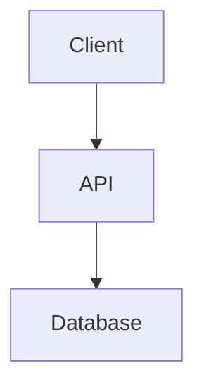

# 🎨 Design: [Idea Name]

> **Design Date:** YYYY-MM-DD
>
> **Based on:** [ideas/idea-name/README.md](../ideas/idea-name/README.md)

## Project Context

<!-- Summary of the current state and brainstorming findings -->

## Evaluated Approaches

### Approach 1: [Name]

- **Description:**
- **Pros:**
- **Cons:**
- **Estimated Complexity:** Low / Medium / High

### Approach 2: [Name]

- **Description:**
- **Pros:**
- **Cons:**
- **Estimated Complexity:** Low / Medium / High

### Approach 3: [Name] *(optional)*

- **Description:**
- **Pros:**
- **Cons:**
- **Estimated Complexity:** Low / Medium / High

### ✅ Selected Approach

<!-- Which one was chosen and why -->

**Selected:** Approach N

**Justification:**

## Detailed Design

### Architecture

<!-- Description of the system architecture -->

### Main Components

<!-- List of components and their responsibilities -->

| Component | Responsibility | Dependencies |
|-----------|----------------|--------------|
|           |                |              |

### Data Model

<!-- Main data schema -->

### Data Flow

<!-- How information flows through the system -->

### Error Handling

<!-- Strategy for errors and edge cases -->

### Testing

<!-- Testing strategy -->

- **Unit:**
- **Integration:**
- **E2E:**

## Design Decisions

<!-- Important decisions made during the process -->

| Decision | Alternatives Considered | Reason |
|----------|-------------------------|--------|
|          |                         |        |

## Approval

- [ ] Design reviewed and approved
- **Approved by:** ___
- **Date:** ___
